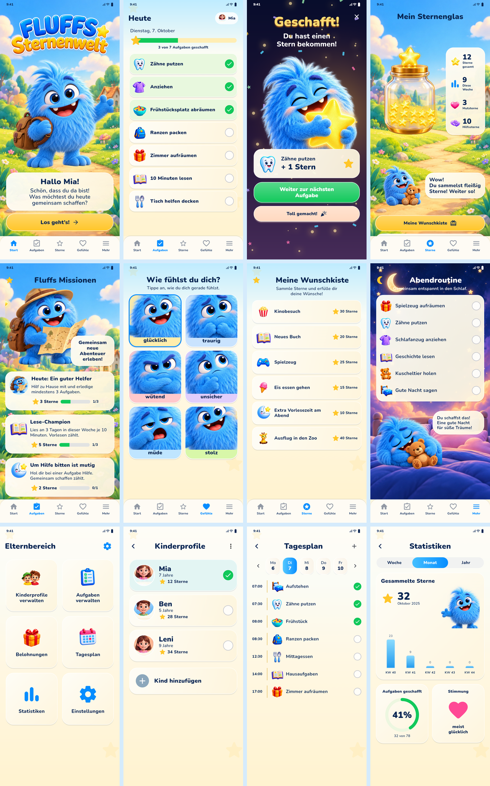

# Fluffs Sternenwelt

Eine vollständige deutschsprachige Flutter-App für Android. Fluff begleitet Kinder bei Alltagsaufgaben, Gefühlen und kleinen Missionen. Die zwölf Ansichten orientieren sich an der gelieferten Vorlage: glänzende blaue und goldene Elemente, cremefarbene Karten, Fluffs bunte Welt und dieselbe Navigation.

## Starten

1. Die APK auf einem Android-Gerät mit ARM64-Prozessor und Android 7 oder neuer installieren. Das Gerät kann für diese einzelne Installation eine Freigabe für die Datei-App verlangen.
2. Beim ersten Start das erste Kind und eine eigene vierstellige Eltern-PIN anlegen.
3. Weitere Kinder, Aufgaben, Wünsche und den Tagesplan im Elternbereich verwalten.

Es gibt keine voreingestellte PIN und keine vorausgefüllten Kinderkonten. Die App benötigt kein Konto und keine Internetverbindung. Stimme und Grafiken liegen im Projekt.

## Enthalten

- Startseite mit Fluff, Rucksack, Logo und Begrüßung.
- Tagesaufgaben mit Einzelschritten, Hilfeschalter, Fortschritt und Sternfeier.
- Sternenglas mit tatsächlichem Guthaben und Verlauf.
- Missionen: drei Hilfsaufgaben, Lesen an drei unterschiedlichen Tagen derselben Woche und um Hilfe bitten.
- Sechs Gefühle mit passenden Fluff-Motiven und unterstützenden Antworten. Gefühle bringen keine Sterne.
- Sechs Wünsche aus der Vorlage, anpassbar durch Eltern. Sterne werden erst nach Elternbestätigung abgezogen.
- Abendroutine und Tagesplan mit Uhrzeiten und Wochenauswahl.
- Elternbereich mit Kinderprofilen, Aufgaben, Belohnungen, Tagesplan, echten Statistiken und Einstellungen.
- Lokale SQLite-Speicherung, JSON-Sicherung und Wiederherstellung.

Fluff atmet, winkt, blinzelt und reagiert auf Antippen. Beim Start bewegt sich sein Arm; andere Ansichten nutzen passende Fluff-Posen. Bei einer erledigten Aufgabe springt Fluff und Konfetti fällt. Bewegungen, Stimme und Vibration können einzeln ausgeschaltet werden. Dies ist eine Animation aus Grafiken und Flutter-Bewegungen, kein frei bewegliches 3D-Modell.

## Entwicklung

Benötigt werden Flutter 3.35.7, Dart 3.9.2, Java 17 und die Android-SDK-Werkzeuge. Android Studio kann die Android-Komponenten installieren.

```bash
flutter pub get
flutter analyze
flutter test --concurrency=1
flutter build apk --release --target-platform android-arm64
```

Die fertige APK liegt unter `build/app/outputs/flutter-apk/app-release.apk`. Der Gradle-Wrapper ist enthalten. `android/local.properties` entsteht lokal und gehört nicht in Git. Die GitHub-Aktion erstellt nach einem Push oder manuellem Start ebenfalls ein APK-Artefakt.

Die beigelegte APK ist für direkte Erprobung mit einer Entwicklungssignatur gebaut. Für einen Play-Store-Release eine eigene sichere Signatur konfigurieren. Schlüsseldateien und `key.properties` werden nicht veröffentlicht. Frühere Installationen mit anderem Paketnamen oder anderer Signatur werden nicht automatisch überschrieben.

## Daten

Jedes Kind hat ein eigenes Guthaben und eigene Tagesfortschritte. Jede Aufgabe zählt höchstens einmal pro Kind und Kalendertag. Bonusmissionen zählen höchstens einmal pro Tag beziehungsweise Lesewoche. Ein Rückgängig-Schritt nimmt nur den betreffenden Aufgabenstern und dadurch ungültig gewordene aktuelle Boni zurück; bereits ausgegebene Sterne können kein negatives Guthaben erzeugen.

Der tägliche Aufgabenplan wird gespeichert. Spätere Änderungen an Vorlagen schreiben vergangene Statistiken nicht um. Tage ohne gespeicherten Plan werden nicht als unerledigt erfunden. Die Sterne in den Diagrammen sind verdienter Zuwachs; das Sternenglas zeigt das verfügbare Guthaben nach erfüllten Wünschen.

Die Eltern-PIN wird mit zufälligem Salt gehasht. Sie schützt den Elternbereich innerhalb der App; die gesamte Datenbank ist nicht verschlüsselt. Nach fünf falschen Versuchen folgt eine kurze Wartezeit. Nach dem Wechsel zu einer anderen App wird der Elternbereich gesperrt; der ausdrücklich geöffnete Dateidialog für Sicherungen ist davon ausgenommen.

Eine Deinstallation löscht lokale Daten. Vorher unter Einstellungen eine Sicherung speichern. Sicherungen enthalten personenbezogene Profildaten und den PIN-Hash. Die Wiederherstellung unterstützt das Sicherungsformat dieser Version (Schema 2); eine automatische Übernahme aus älteren unvollständigen Zusatzpaketen ist nicht enthalten.

## Gestaltung und Prüfung

Die Vorlagen sind die Grundlage für Farben, Aufteilung, Motive und Beschriftungen. Die Figuren und Hintergründe wurden für einzelne App-Ansichten aus der gelieferten Fluff-Referenz aufbereitet. Das Poster enthält kleine, zusammengefügte Ansichten; daraus entsteht keine garantiert pixelidentische Umsetzung auf jeder Displaygröße. Alle Bilder sind eingebunden, keine Platzhalter oder externen Bildlinks.

Die Dateien in `previews/` entstehen durch `flutter test test/visual_preview_test.dart --dart-define=RENDER_PREVIEWS=true`. Sie zeigen echte Flutter-Ansichten mit ausschließlich für die Vorschau erzeugten Daten. Diese Daten gelangen nicht in die installierte App. Grafiken, Font-Lizenz und Audio sind im Quellpaket enthalten.

`VALIDATION.md` beschreibt den Prüfstand. `previews/Fluff-Animation.mp4` zeigt den bewegten Begrüßungsarm in der echten Flutter-Ansicht. `ARTWORK.md` und `docs/artwork-prompts.json` dokumentieren die verwendeten Grafiken.


